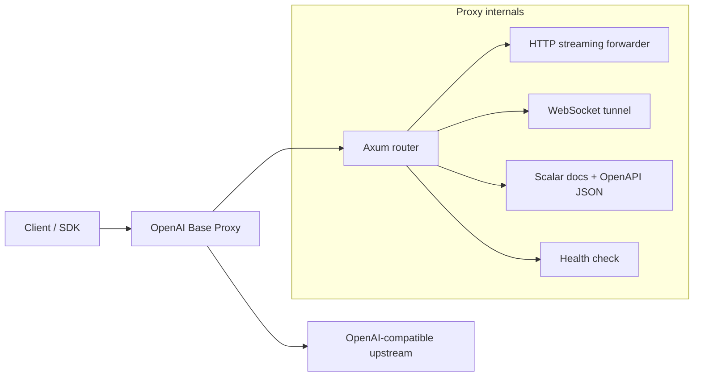

# OpenAI Base Proxy

[English](README.md) | [Simplified Chinese](docs/README.zh-CN.md) | [Japanese](docs/README.ja.md) | [Spanish](docs/README.es.md)

OpenAI Base Proxy is a small Rust/Axum transparent proxy for OpenAI-compatible APIs. It is designed for deployments where clients need a stable, nearby, OpenAI-compatible `base_url` while preserving OpenAI API semantics: request fields are not validated, rewritten, or narrowed by the proxy.

The default upstream is `https://api.openai.com`.

## Why This Exists

Some regions, networks, or production environments have high latency or unreliable direct access to the OpenAI API. This proxy lets you place a lightweight service closer to your users or infrastructure while keeping client behavior as close as possible to calling OpenAI directly.

The core design rule is simple:

> If the client sends an OpenAI API request, the proxy forwards it to the upstream API without understanding or constraining OpenAI-specific fields.

That means future OpenAI request parameters, model-specific options, multipart uploads, SSE streams, WebSocket events, and binary responses remain pass-through compatible.

## Features

- Transparent BYOK forwarding: client `Authorization: Bearer ...` is passed to the upstream API.
- Transparent HTTP forwarding for OpenAI-compatible `/v1/...` endpoints.
- Streaming request bodies: uploads are forwarded as streams instead of being fully buffered first.
- Streaming response bodies: SSE, binary downloads, audio, and file content are streamed back to clients.
- WebSocket proxying for OpenAI `/v1/...` upgrade requests, including Realtime, Realtime translation, sideband/server controls, and Responses WebSocket mode.
- WebRTC setup endpoint support through normal HTTP forwarding, including SDP bodies.
- Preserves upstream status codes, response bodies, and end-to-end headers such as `x-request-id`, rate-limit headers, `retry-after`, `location`, `content-range`, and `content-encoding`.
- Filters hop-by-hop headers, `Host`, `Content-Length`, and proxy-only auth headers.
- Optional proxy-side token via `x-proxy-token`.
- Built-in Scalar API reference UI at `/docs`.
- Health check at `/__healthz`.

## Non-Goals

This project intentionally does not:

- parse or validate OpenAI JSON request fields;
- rewrite model names;
- inject a server-owned OpenAI key;
- cache responses;
- implement rate limiting by default;
- terminate or relay WebRTC media traffic;
- implement SIP/TLS phone media handling;
- receive or verify OpenAI webhooks;
- reimplement OpenAI SDK behavior.

Those choices keep the proxy thin and compatible.

## Architecture



### HTTP Data Flow

1. The client calls this proxy with an OpenAI-compatible path such as `/v1/responses`.
2. The proxy builds the upstream URL from `UPSTREAM_BASE_URL + path_and_query`.
3. Hop-by-hop headers, `Host`, `Content-Length`, and `x-proxy-token` are removed.
4. The request body is streamed to upstream using `reqwest::Body::wrap_stream`.
5. The upstream response status, headers, and body stream are returned to the client.

The proxy does not deserialize the OpenAI request body. JSON, multipart form data, SDP, text, binary payloads, and future request shapes all share the same forwarding path.

### WebSocket Data Flow

1. The client sends a WebSocket `Upgrade` request under `/v1/...`.
2. The proxy maps `https://` upstreams to `wss://` and `http://` loopback upstreams to `ws://`.
3. The upstream WebSocket connection is established before the client upgrade is accepted.
4. End-to-end headers such as `Authorization`, `OpenAI-Safety-Identifier`, and `Sec-WebSocket-Protocol` are preserved.
5. The selected upstream subprotocol is returned to the client.
6. Text, binary, ping, pong, and close frames are forwarded in both directions.

Unsupported WebSocket paths are left for the upstream API to accept or reject, as long as they are under `/v1/...`.

## Supported OpenAI API Surface

Because HTTP forwarding is path- and body-transparent, the proxy is intended to support current and future OpenAI-compatible REST endpoints under `/v1/...`.

| Area | Status | Notes |
| --- | --- | --- |
| Responses API | Supported | HTTP and SSE streaming are forwarded. Responses WebSocket mode is supported on `/v1/responses`. |
| Chat Completions | Supported | HTTP and streaming responses are forwarded transparently. |
| Embeddings | Supported | JSON request and response forwarding. |
| Images | Supported | JSON, multipart, streaming events, and binary-like payloads are forwarded by the generic HTTP path. |
| Audio | Supported | Speech, transcription, translation, multipart uploads, SSE, and binary audio responses are handled by streaming HTTP forwarding. |
| Files | Supported | Uploads and file content downloads are forwarded, including binary and range-style responses. |
| Uploads | Supported | Multipart upload parts are forwarded without rewriting boundaries or repeated fields. |
| Batches | Supported | Batch creation and output file download are forwarded. |
| Fine-tuning | Supported | HTTP endpoints are forwarded. |
| Moderations | Supported | HTTP endpoints are forwarded. |
| Models | Supported | List/retrieve/delete requests are forwarded. |
| Realtime WebSocket | Supported | `/v1/realtime?model=...` and `/v1/realtime?call_id=...`. |
| Realtime translation WebSocket | Supported | `/v1/realtime/translations?model=...`. |
| Realtime WebRTC setup | Supported | HTTP SDP/session creation endpoints are forwarded. WebRTC media itself is not proxied. |
| Realtime SIP control plane | Supported through HTTP/WS forwarding | SIP media and SIP/TLS trunking are not proxied. |
| Webhooks | Not a proxy responsibility | OpenAI calls your application. This service does not receive or verify webhooks. |

## API Documentation

The proxy serves local documentation:

- `GET /docs` - Scalar API reference UI.
- `GET /scalar` - Alias for `/docs`.
- `GET /openapi.json` - OpenAPI 3.1 document used by Scalar.

The OpenAPI document describes the proxy surface and documented transport behavior. It intentionally does not enumerate OpenAI request schemas, because doing so would make the proxy less future-compatible.

## Configuration

| Environment variable | Default | Description |
| --- | --- | --- |
| `BIND_ADDR` | `0.0.0.0:3000` | Address the proxy listens on. |
| `UPSTREAM_BASE_URL` | `https://api.openai.com` | OpenAI-compatible upstream base URL. |
| `OPENAI_BASE_URL` | unset | Alias used when `UPSTREAM_BASE_URL` is unset. |
| `PROXY_TOKEN` | unset | Optional proxy-side token required in `x-proxy-token`. |
| `OPENAI_PROXY_TOKEN` | unset | Alias used when `PROXY_TOKEN` is unset. |
| `CONNECT_TIMEOUT_SECS` | `30` | Upstream TCP connect timeout. Long streams are not bounded by a total request timeout. |

`UPSTREAM_BASE_URL` must use HTTPS, except loopback HTTP is allowed for tests and local development.

## Running Locally

```bash
cp .env.example .env
cargo run
```

Try the health check:

```bash
curl http://127.0.0.1:3000/__healthz
```

Call the OpenAI API through the proxy:

```bash
curl http://127.0.0.1:3000/v1/models \
  -H "Authorization: Bearer $OPENAI_API_KEY"
```

With proxy-side protection enabled:

```bash
PROXY_TOKEN=proxy-secret cargo run

curl http://127.0.0.1:3000/v1/models \
  -H "x-proxy-token: proxy-secret" \
  -H "Authorization: Bearer $OPENAI_API_KEY"
```

## OpenAI SDK Usage

Point your SDK `base_url` or equivalent option at this proxy.

Example:

```text
http://127.0.0.1:3000/v1
```

Clients should still send their own OpenAI API key:

```text
Authorization: Bearer <your OpenAI API key>
```

If `PROXY_TOKEN` is configured, clients also need:

```text
x-proxy-token: <proxy token>
```

## WebSocket Examples

Realtime:

```bash
websocat \
  -H "Authorization: Bearer $OPENAI_API_KEY" \
  "ws://127.0.0.1:3000/v1/realtime?model=gpt-realtime-2.1"
```

Realtime translation:

```bash
websocat \
  -H "Authorization: Bearer $OPENAI_API_KEY" \
  "ws://127.0.0.1:3000/v1/realtime/translations?model=gpt-realtime-translate"
```

Responses WebSocket mode:

```bash
websocat \
  -H "Authorization: Bearer $OPENAI_API_KEY" \
  "ws://127.0.0.1:3000/v1/responses"
```

## Docker Deployment

Build:

```bash
docker build -t openai-base-proxy .
```

Run:

```bash
docker run --rm -p 3000:3000 \
  -e BIND_ADDR=0.0.0.0:3000 \
  -e PROXY_TOKEN=proxy-secret \
  openai-base-proxy
```

## Systemd Deployment

Example unit:

```ini
[Unit]
Description=OpenAI Base Proxy
After=network-online.target
Wants=network-online.target

[Service]
Type=simple
WorkingDirectory=/opt/openai-base-proxy
Environment=BIND_ADDR=127.0.0.1:3000
Environment=UPSTREAM_BASE_URL=https://api.openai.com
Environment=PROXY_TOKEN=change-me
ExecStart=/opt/openai-base-proxy/openai-base-proxy
Restart=always
RestartSec=3

[Install]
WantedBy=multi-user.target
```

For public deployments, place the service behind a TLS reverse proxy such as Nginx, Caddy, Envoy, or a cloud load balancer.

## Production Notes

- Set `PROXY_TOKEN` when exposing the proxy outside localhost or a trusted private network.
- Terminate TLS at a reverse proxy or load balancer.
- Redact `Authorization`, `x-proxy-token`, and `Sec-WebSocket-Protocol` from logs. Browser Realtime WebSocket examples can carry API keys in subprotocol values.
- Add infrastructure-level rate limits and connection limits for public deployments.
- Keep the proxy close to your clients or servers to reduce latency.
- Avoid request/response body logging. OpenAI API bodies may contain user data, files, audio, or secrets.

## Verification

Run:

```bash
cargo fmt --check
cargo test
cargo clippy --all-targets --all-features -- -D warnings
cargo build --release
```

The integration tests cover:

- HTTP method/path/query/header/body forwarding.
- SSE response streaming.
- multipart upload boundary and repeated-field preservation.
- request body streaming without full buffering.
- binary and range-style file download behavior.
- proxy-side token enforcement.
- Realtime WebSocket forwarding.
- Realtime translation WebSocket forwarding.
- Responses WebSocket mode.
- browser-style WebSocket subprotocol forwarding.
- upstream WebSocket handshake error transparency.
- WebRTC SDP HTTP forwarding.
- Scalar docs and OpenAPI JSON endpoints.

## Design Tradeoffs

### Why not validate OpenAI request schemas?

Validation would make the proxy less compatible with new OpenAI fields and model-specific parameters. The upstream API should remain the source of truth.

### Why remove `Content-Length`?

The proxy streams request and response bodies. Removing `Content-Length` lets the HTTP stack choose safe transfer framing after hop-by-hop filtering.

### Why not proxy WebRTC media?

WebRTC media is not ordinary HTTP or WebSocket traffic. Relaying media would require TURN/SFU/ICE/DTLS/SRTP handling or acting as a WebRTC peer, which is outside this proxy's scope.

### Why serve a simplified OpenAPI document?

The OpenAPI document documents the proxy, not the full OpenAI API schema. The goal is to make operational behavior clear without freezing upstream request fields.
