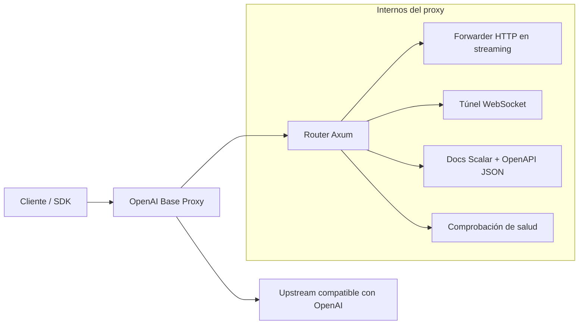

# OpenAI Base Proxy

[English](../README.md) | [简体中文](README.zh-CN.md) | [日本語](README.ja.md) | [Español](README.es.md)

OpenAI Base Proxy es un pequeño proxy transparente escrito con Rust y Axum para APIs compatibles con OpenAI. Está diseñado para despliegues donde los clientes necesitan un `base_url` estable, cercano y compatible con OpenAI, preservando la semántica de la API de OpenAI: el proxy no valida, reescribe ni limita los campos de la solicitud.

El upstream predeterminado es `https://api.openai.com`.

## Por Qué Existe

En algunas regiones, redes o entornos de producción, el acceso directo a la API de OpenAI puede tener mucha latencia o ser poco fiable. Este proxy permite colocar un servicio ligero más cerca de tus usuarios o infraestructura, manteniendo el comportamiento del cliente lo más parecido posible a llamar directamente a OpenAI.

La regla central de diseño es simple:

> Si el cliente envía una solicitud de la API de OpenAI, el proxy la reenvía al upstream sin entender ni restringir campos específicos de OpenAI.

Eso significa que futuros parámetros de solicitud de OpenAI, opciones específicas de modelos, cargas multipart, flujos SSE, eventos WebSocket y respuestas binarias siguen siendo compatibles por paso transparente.

## Funciones

- Reenvío BYOK transparente: el `Authorization: Bearer ...` del cliente se envía al API upstream.
- Reenvío HTTP transparente para endpoints `/v1/...` compatibles con OpenAI.
- Cuerpos de solicitud en streaming: las cargas se reenvían como streams en lugar de almacenarse completas primero.
- Cuerpos de respuesta en streaming: SSE, descargas binarias, audio y contenido de archivos se devuelven al cliente como stream.
- Proxy WebSocket para solicitudes OpenAI `/v1/...` con upgrade, incluyendo Realtime, Realtime translation, sideband/server controls y Responses WebSocket mode.
- Soporte para endpoints de configuración WebRTC mediante reenvío HTTP normal, incluyendo cuerpos SDP.
- Conserva códigos de estado, cuerpos de respuesta y headers end-to-end del upstream como `x-request-id`, rate-limit headers, `retry-after`, `location`, `content-range` y `content-encoding`.
- Filtra hop-by-hop headers, `Host`, `Content-Length` y headers de autenticación exclusivos del proxy.
- Token opcional del lado del proxy mediante `x-proxy-token`.
- Referencia de API Scalar integrada en `/docs`.
- Health check en `/__healthz`.

## Fuera de Alcance

Este proyecto intencionalmente no:

- analiza ni valida campos JSON de solicitudes OpenAI;
- reescribe nombres de modelos;
- inyecta una clave OpenAI propiedad del servidor;
- cachea respuestas;
- implementa rate limiting por defecto;
- termina ni retransmite tráfico de medios WebRTC;
- implementa manejo de medios telefónicos SIP/TLS;
- recibe ni verifica webhooks de OpenAI;
- reimplementa el comportamiento de los SDK de OpenAI.

Estas decisiones mantienen el proxy delgado y compatible.

## Arquitectura



### Flujo de Datos HTTP

1. El cliente llama a este proxy con una ruta compatible con OpenAI, como `/v1/responses`.
2. El proxy construye la URL upstream con `UPSTREAM_BASE_URL + path_and_query`.
3. Se eliminan hop-by-hop headers, `Host`, `Content-Length` y `x-proxy-token`.
4. El cuerpo de la solicitud se envía al upstream como stream usando `reqwest::Body::wrap_stream`.
5. El estado, los headers y el stream del cuerpo de la respuesta upstream se devuelven al cliente.

El proxy no deserializa el cuerpo de la solicitud OpenAI. JSON, multipart form data, SDP, texto, payloads binarios y futuras formas de solicitud comparten la misma ruta de reenvío.

### Flujo de Datos WebSocket

1. El cliente envía una solicitud WebSocket `Upgrade` bajo `/v1/...`.
2. El proxy mapea upstreams `https://` a `wss://` y upstreams loopback `http://` a `ws://`.
3. La conexión WebSocket upstream se establece antes de aceptar el upgrade del cliente.
4. Se conservan headers end-to-end como `Authorization`, `OpenAI-Safety-Identifier` y `Sec-WebSocket-Protocol`.
5. El subprotocolo seleccionado por el upstream se devuelve al cliente.
6. Los frames text, binary, ping, pong y close se reenvían en ambas direcciones.

Las rutas WebSocket no soportadas se dejan para que el API upstream las acepte o rechace, siempre que estén bajo `/v1/...`.

## Superficie de API OpenAI Soportada

Como el reenvío HTTP es transparente en ruta y cuerpo, el proxy está pensado para soportar endpoints REST compatibles con OpenAI actuales y futuros bajo `/v1/...`.

| Área | Estado | Notas |
| --- | --- | --- |
| Responses API | Soportado | HTTP y SSE streaming se reenvían. Responses WebSocket mode está soportado en `/v1/responses`. |
| Chat Completions | Soportado | HTTP y streaming responses se reenvían de forma transparente. |
| Embeddings | Soportado | Reenvío de solicitudes y respuestas JSON. |
| Images | Soportado | JSON, multipart, streaming events y payloads similares a binarios se reenvían por la ruta HTTP genérica. |
| Audio | Soportado | Speech, transcription, translation, multipart uploads, SSE y respuestas de audio binario se manejan mediante reenvío HTTP en streaming. |
| Files | Soportado | Se reenvían cargas y descargas de contenido de archivos, incluyendo respuestas binarias y de estilo range. |
| Uploads | Soportado | Las partes de multipart upload se reenvían sin reescribir boundaries ni campos repetidos. |
| Batches | Soportado | Se reenvían la creación de batches y la descarga de archivos de salida. |
| Fine-tuning | Soportado | Los endpoints HTTP se reenvían. |
| Moderations | Soportado | Los endpoints HTTP se reenvían. |
| Models | Soportado | Se reenvían solicitudes list/retrieve/delete. |
| Realtime WebSocket | Soportado | `/v1/realtime?model=...` y `/v1/realtime?call_id=...`. |
| Realtime translation WebSocket | Soportado | `/v1/realtime/translations?model=...`. |
| Realtime WebRTC setup | Soportado | Se reenvían endpoints HTTP de creación SDP/session. El medio WebRTC en sí no se proxifica. |
| Realtime SIP control plane | Soportado mediante reenvío HTTP/WS | SIP media y SIP/TLS trunking no se proxifican. |
| Webhooks | No es responsabilidad del proxy | OpenAI llama a tu aplicación. Este servicio no recibe ni verifica webhooks. |

## Documentación de API

El proxy sirve documentación local:

- `GET /docs` - UI de referencia API Scalar.
- `GET /scalar` - Alias de `/docs`.
- `GET /openapi.json` - Documento OpenAPI 3.1 usado por Scalar.

El documento OpenAPI describe la superficie del proxy y el comportamiento de transporte documentado. Intencionalmente no enumera schemas de solicitudes OpenAI, porque hacerlo haría que el proxy fuese menos compatible con cambios futuros.

## Configuración

| Variable de entorno | Predeterminado | Descripción |
| --- | --- | --- |
| `BIND_ADDR` | `0.0.0.0:3000` | Dirección en la que escucha el proxy. |
| `UPSTREAM_BASE_URL` | `https://api.openai.com` | Base URL del upstream compatible con OpenAI. |
| `OPENAI_BASE_URL` | sin definir | Alias usado cuando `UPSTREAM_BASE_URL` no está definido. |
| `PROXY_TOKEN` | sin definir | Token opcional del lado del proxy requerido en `x-proxy-token`. |
| `OPENAI_PROXY_TOKEN` | sin definir | Alias usado cuando `PROXY_TOKEN` no está definido. |
| `CONNECT_TIMEOUT_SECS` | `30` | Timeout de conexión TCP al upstream. Los streams largos no están limitados por un timeout total de solicitud. |

`UPSTREAM_BASE_URL` debe usar HTTPS, excepto que se permite HTTP loopback para pruebas y desarrollo local.

## Ejecución Local

```bash
cp .env.example .env
cargo run
```

Prueba el health check:

```bash
curl http://127.0.0.1:3000/__healthz
```

Llama a la API de OpenAI a través del proxy:

```bash
curl http://127.0.0.1:3000/v1/models \
  -H "Authorization: Bearer $OPENAI_API_KEY"
```

Con protección del lado del proxy habilitada:

```bash
PROXY_TOKEN=proxy-secret cargo run

curl http://127.0.0.1:3000/v1/models \
  -H "x-proxy-token: proxy-secret" \
  -H "Authorization: Bearer $OPENAI_API_KEY"
```

## Uso con SDKs de OpenAI

Apunta el `base_url` de tu SDK, o su opción equivalente, a este proxy.

Ejemplo:

```text
http://127.0.0.1:3000/v1
```

Los clientes deben seguir enviando su propia clave de API de OpenAI:

```text
Authorization: Bearer <your OpenAI API key>
```

Si `PROXY_TOKEN` está configurado, los clientes también necesitan:

```text
x-proxy-token: <proxy token>
```

## Ejemplos WebSocket

Realtime:

```bash
websocat \
  -H "Authorization: Bearer $OPENAI_API_KEY" \
  "ws://127.0.0.1:3000/v1/realtime?model=gpt-realtime-2.1"
```

Realtime translation:

```bash
websocat \
  -H "Authorization: Bearer $OPENAI_API_KEY" \
  "ws://127.0.0.1:3000/v1/realtime/translations?model=gpt-realtime-translate"
```

Responses WebSocket mode:

```bash
websocat \
  -H "Authorization: Bearer $OPENAI_API_KEY" \
  "ws://127.0.0.1:3000/v1/responses"
```

## Despliegue con Docker

Construir:

```bash
docker build -t openai-base-proxy .
```

Ejecutar:

```bash
docker run --rm -p 3000:3000 \
  -e BIND_ADDR=0.0.0.0:3000 \
  -e PROXY_TOKEN=proxy-secret \
  openai-base-proxy
```

## Despliegue con Systemd

Unit de ejemplo:

```ini
[Unit]
Description=OpenAI Base Proxy
After=network-online.target
Wants=network-online.target

[Service]
Type=simple
WorkingDirectory=/opt/openai-base-proxy
Environment=BIND_ADDR=127.0.0.1:3000
Environment=UPSTREAM_BASE_URL=https://api.openai.com
Environment=PROXY_TOKEN=change-me
ExecStart=/opt/openai-base-proxy/openai-base-proxy
Restart=always
RestartSec=3

[Install]
WantedBy=multi-user.target
```

Para despliegues públicos, coloca el servicio detrás de un proxy inverso TLS como Nginx, Caddy, Envoy o un balanceador de carga cloud.

## Notas de Producción

- Configura `PROXY_TOKEN` al exponer el proxy fuera de localhost o de una red privada confiable.
- Termina TLS en un proxy inverso o balanceador de carga.
- Redacta `Authorization`, `x-proxy-token` y `Sec-WebSocket-Protocol` en los logs. Los ejemplos Realtime WebSocket de navegador pueden transportar API keys en valores de subprotocolo.
- Añade rate limits y límites de conexión a nivel de infraestructura para despliegues públicos.
- Mantén el proxy cerca de tus clientes o servidores para reducir la latencia.
- Evita registrar cuerpos de solicitud/respuesta. Los cuerpos de la API de OpenAI pueden contener datos de usuario, archivos, audio o secretos.

## Verificación

Ejecuta:

```bash
cargo fmt --check
cargo test
cargo clippy --all-targets --all-features -- -D warnings
cargo build --release
```

Las pruebas de integración cubren:

- Reenvío de HTTP method/path/query/header/body.
- Streaming de respuestas SSE.
- Preservación de multipart upload boundary y campos repetidos.
- Streaming del cuerpo de solicitud sin almacenamiento completo.
- Comportamiento de descarga de archivos binarios y de estilo range.
- Cumplimiento del token del lado del proxy.
- Reenvío Realtime WebSocket.
- Reenvío Realtime translation WebSocket.
- Responses WebSocket mode.
- Reenvío de subprotocolos WebSocket estilo navegador.
- Transparencia de errores de handshake WebSocket upstream.
- Reenvío HTTP de WebRTC SDP.
- Endpoints Scalar docs y OpenAPI JSON.

## Decisiones de Diseño

### ¿Por Qué No Validar Schemas de Solicitudes OpenAI?

La validación haría que el proxy fuese menos compatible con nuevos campos de OpenAI y parámetros específicos de modelos. La API upstream debe seguir siendo la fuente de verdad.

### ¿Por Qué Eliminar `Content-Length`?

El proxy transmite cuerpos de solicitud y respuesta como streams. Eliminar `Content-Length` permite que la pila HTTP elija un framing de transferencia seguro después de filtrar hop-by-hop headers.

### ¿Por Qué No Proxificar Medios WebRTC?

Los medios WebRTC no son tráfico HTTP o WebSocket ordinario. Retransmitir medios requeriría manejar TURN/SFU/ICE/DTLS/SRTP o actuar como un peer WebRTC, lo cual queda fuera del alcance de este proxy.

### ¿Por Qué Servir un Documento OpenAPI Simplificado?

El documento OpenAPI describe el proxy, no el schema completo de la API de OpenAI. El objetivo es aclarar el comportamiento operativo sin congelar los campos de solicitud del upstream.
