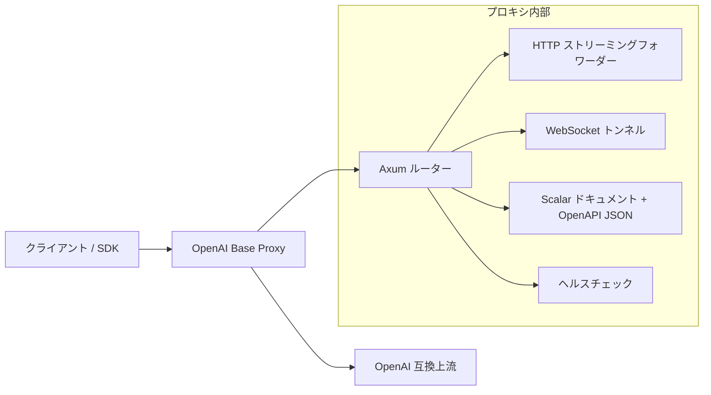

# OpenAI Base Proxy

[English](../README.md) | [简体中文](README.zh-CN.md) | [日本語](README.ja.md) | [Español](README.es.md)

OpenAI Base Proxy は、OpenAI 互換 API のための小さな Rust/Axum 製透明プロキシです。クライアントに安定した近距離の OpenAI 互換 `base_url` を提供しつつ、OpenAI API の意味論を保つように設計されています。プロキシはリクエストフィールドを検証、書き換え、または制限しません。

デフォルトの上流は `https://api.openai.com` です。

## このプロジェクトの目的

一部の地域、ネットワーク、または本番環境では、OpenAI API への直接アクセスが遅かったり不安定だったりします。このプロキシをユーザーやインフラの近くに配置することで、クライアントの挙動を OpenAI へ直接呼び出す場合にできるだけ近づけられます。

中心となる設計ルールは単純です。

> クライアントが OpenAI API リクエストを送った場合、プロキシは OpenAI 固有のフィールドを理解したり制限したりせず、そのまま上流 API に転送します。

これにより、将来追加される OpenAI のリクエストパラメータ、モデル固有オプション、multipart アップロード、SSE ストリーム、WebSocket イベント、バイナリレスポンスも透過的に通せます。

## 機能

- 透過的な BYOK 転送: クライアントの `Authorization: Bearer ...` を上流 API に渡します。
- OpenAI 互換の `/v1/...` エンドポイントを透過的に HTTP 転送します。
- リクエストボディをストリーミング転送し、先に全体をバッファしません。
- レスポンスボディをストリーミング転送し、SSE、バイナリダウンロード、音声、ファイル内容をクライアントに返します。
- OpenAI `/v1/...` の WebSocket プロキシに対応し、Realtime、Realtime translation、sideband/server controls、Responses WebSocket mode を含みます。
- 通常の HTTP 転送により、SDP body を含む WebRTC セットアップエンドポイントに対応します。
- 上流のステータスコード、レスポンスボディ、`x-request-id`、rate-limit headers、`retry-after`、`location`、`content-range`、`content-encoding` などの end-to-end headers を保持します。
- hop-by-hop headers、`Host`、`Content-Length`、プロキシ専用の認証 header を除去します。
- `x-proxy-token` による任意のプロキシ側 token に対応します。
- `/docs` に組み込みの Scalar API reference UI を提供します。
- `/__healthz` にヘルスチェックを提供します。

## 対象外

このプロジェクトは意図的に以下を行いません。

- OpenAI JSON リクエストフィールドの解析または検証。
- モデル名の書き換え。
- サーバー所有の OpenAI key の注入。
- レスポンスのキャッシュ。
- デフォルトのレート制限。
- WebRTC メディアトラフィックの終端または中継。
- SIP/TLS 電話メディア処理の実装。
- OpenAI webhooks の受信または検証。
- OpenAI SDK 挙動の再実装。

これらの選択により、プロキシを薄く互換性の高いものにしています。

## アーキテクチャ



### HTTP データフロー

1. クライアントは `/v1/responses` のような OpenAI 互換パスでこのプロキシを呼び出します。
2. プロキシは `UPSTREAM_BASE_URL + path_and_query` から上流 URL を構築します。
3. hop-by-hop headers、`Host`、`Content-Length`、`x-proxy-token` を削除します。
4. `reqwest::Body::wrap_stream` を使ってリクエストボディを上流へストリーミングします。
5. 上流レスポンスのステータス、headers、body stream をクライアントへ返します。

プロキシは OpenAI リクエストボディをデシリアライズしません。JSON、multipart form data、SDP、テキスト、バイナリ payload、将来の新しいリクエスト形式はすべて同じ転送経路を使います。

### WebSocket データフロー

1. クライアントは `/v1/...` 配下に WebSocket `Upgrade` リクエストを送ります。
2. プロキシは `https://` の上流を `wss://` に、loopback の `http://` 上流を `ws://` に変換します。
3. クライアントの upgrade を受け入れる前に、上流 WebSocket 接続を確立します。
4. `Authorization`、`OpenAI-Safety-Identifier`、`Sec-WebSocket-Protocol` などの end-to-end headers を保持します。
5. 上流が選択した subprotocol をクライアントへ返します。
6. text、binary、ping、pong、close frames を双方向に転送します。

サポート外の WebSocket パスでも、`/v1/...` 配下であれば上流 API が受け入れるか拒否するかを判断します。

## 対応する OpenAI API 範囲

HTTP 転送はパスと body に対して透明なので、このプロキシは `/v1/...` 配下の現在および将来の OpenAI 互換 REST エンドポイントに対応することを意図しています。

| 領域 | 状態 | 備考 |
| --- | --- | --- |
| Responses API | 対応 | HTTP と SSE streaming を転送します。`/v1/responses` の Responses WebSocket mode に対応します。 |
| Chat Completions | 対応 | HTTP と streaming responses を透過的に転送します。 |
| Embeddings | 対応 | JSON リクエストとレスポンスを転送します。 |
| Images | 対応 | JSON、multipart、streaming events、バイナリ風 payload を汎用 HTTP 経路で転送します。 |
| Audio | 対応 | Speech、transcription、translation、multipart uploads、SSE、バイナリ音声レスポンスをストリーミング HTTP 転送で扱います。 |
| Files | 対応 | アップロードとファイル内容ダウンロードを転送します。バイナリおよび range-style レスポンスを含みます。 |
| Uploads | 対応 | multipart upload parts を boundary や重複フィールドを書き換えずに転送します。 |
| Batches | 対応 | Batch 作成と出力ファイルダウンロードを転送します。 |
| Fine-tuning | 対応 | HTTP エンドポイントを転送します。 |
| Moderations | 対応 | HTTP エンドポイントを転送します。 |
| Models | 対応 | list/retrieve/delete リクエストを転送します。 |
| Realtime WebSocket | 対応 | `/v1/realtime?model=...` と `/v1/realtime?call_id=...`。 |
| Realtime translation WebSocket | 対応 | `/v1/realtime/translations?model=...`。 |
| Realtime WebRTC setup | 対応 | HTTP SDP/session 作成エンドポイントを転送します。WebRTC メディア自体はプロキシしません。 |
| Realtime SIP control plane | HTTP/WS 転送で対応 | SIP media と SIP/TLS trunking はプロキシしません。 |
| Webhooks | プロキシの責務外 | OpenAI があなたのアプリケーションを呼び出します。このサービスは webhooks を受信または検証しません。 |

## API ドキュメント

プロキシはローカルドキュメントを提供します。

- `GET /docs` - Scalar API reference UI。
- `GET /scalar` - `/docs` のエイリアス。
- `GET /openapi.json` - Scalar が使用する OpenAPI 3.1 ドキュメント。

OpenAPI ドキュメントは、プロキシの表面と文書化された転送挙動を説明します。OpenAI リクエスト schema は意図的に列挙しません。列挙すると、将来の互換性が低下するためです。

## 設定

| 環境変数 | デフォルト | 説明 |
| --- | --- | --- |
| `BIND_ADDR` | `0.0.0.0:3000` | プロキシが listen するアドレス。 |
| `UPSTREAM_BASE_URL` | `https://api.openai.com` | OpenAI 互換上流 base URL。 |
| `OPENAI_BASE_URL` | 未設定 | `UPSTREAM_BASE_URL` が未設定の場合に使われるエイリアス。 |
| `PROXY_TOKEN` | 未設定 | `x-proxy-token` で要求できる任意のプロキシ側 token。 |
| `OPENAI_PROXY_TOKEN` | 未設定 | `PROXY_TOKEN` が未設定の場合に使われるエイリアス。 |
| `CONNECT_TIMEOUT_SECS` | `30` | 上流 TCP 接続タイムアウト。長いストリームはリクエスト全体のタイムアウトでは制限されません。 |

`UPSTREAM_BASE_URL` は HTTPS である必要があります。ただし、テストとローカル開発では loopback HTTP が許可されます。

## ローカル実行

```bash
cp .env.example .env
cargo run
```

ヘルスチェックを試します。

```bash
curl http://127.0.0.1:3000/__healthz
```

プロキシ経由で OpenAI API を呼び出します。

```bash
curl http://127.0.0.1:3000/v1/models \
  -H "Authorization: Bearer $OPENAI_API_KEY"
```

プロキシ側の保護を有効にする場合:

```bash
PROXY_TOKEN=proxy-secret cargo run

curl http://127.0.0.1:3000/v1/models \
  -H "x-proxy-token: proxy-secret" \
  -H "Authorization: Bearer $OPENAI_API_KEY"
```

## OpenAI SDK の使い方

SDK の `base_url` または同等のオプションをこのプロキシに向けます。

例:

```text
http://127.0.0.1:3000/v1
```

クライアントは引き続き自分の OpenAI API key を送信します。

```text
Authorization: Bearer <your OpenAI API key>
```

`PROXY_TOKEN` が設定されている場合、クライアントには次も必要です。

```text
x-proxy-token: <proxy token>
```

## WebSocket の例

Realtime:

```bash
websocat \
  -H "Authorization: Bearer $OPENAI_API_KEY" \
  "ws://127.0.0.1:3000/v1/realtime?model=gpt-realtime-2.1"
```

Realtime translation:

```bash
websocat \
  -H "Authorization: Bearer $OPENAI_API_KEY" \
  "ws://127.0.0.1:3000/v1/realtime/translations?model=gpt-realtime-translate"
```

Responses WebSocket mode:

```bash
websocat \
  -H "Authorization: Bearer $OPENAI_API_KEY" \
  "ws://127.0.0.1:3000/v1/responses"
```

## Docker デプロイ

ビルド:

```bash
docker build -t openai-base-proxy .
```

実行:

```bash
docker run --rm -p 3000:3000 \
  -e BIND_ADDR=0.0.0.0:3000 \
  -e PROXY_TOKEN=proxy-secret \
  openai-base-proxy
```

## Systemd デプロイ

unit の例:

```ini
[Unit]
Description=OpenAI Base Proxy
After=network-online.target
Wants=network-online.target

[Service]
Type=simple
WorkingDirectory=/opt/openai-base-proxy
Environment=BIND_ADDR=127.0.0.1:3000
Environment=UPSTREAM_BASE_URL=https://api.openai.com
Environment=PROXY_TOKEN=change-me
ExecStart=/opt/openai-base-proxy/openai-base-proxy
Restart=always
RestartSec=3

[Install]
WantedBy=multi-user.target
```

公開環境では、Nginx、Caddy、Envoy、クラウドロードバランサーなどの TLS リバースプロキシの背後に配置してください。

## 本番運用メモ

- localhost または信頼済み private network の外に公開する場合は、`PROXY_TOKEN` を設定してください。
- TLS はリバースプロキシまたはロードバランサーで終端してください。
- ログでは `Authorization`、`x-proxy-token`、`Sec-WebSocket-Protocol` をマスクしてください。ブラウザの Realtime WebSocket 例では、API key が subprotocol 値に入ることがあります。
- 公開環境ではインフラ層でレート制限と接続数制限を追加してください。
- レイテンシを下げるため、プロキシはクライアントまたはサーバーの近くに配置してください。
- リクエスト/レスポンス body のログ出力は避けてください。OpenAI API body にはユーザーデータ、ファイル、音声、秘密情報が含まれる場合があります。

## 検証

実行:

```bash
cargo fmt --check
cargo test
cargo clippy --all-targets --all-features -- -D warnings
cargo build --release
```

統合テストは以下をカバーします。

- HTTP method/path/query/header/body 転送。
- SSE レスポンスストリーミング。
- multipart upload boundary と重複フィールドの保持。
- 全体をバッファしないリクエスト body ストリーミング。
- バイナリおよび range-style ファイルダウンロード挙動。
- プロキシ側 token の強制。
- Realtime WebSocket 転送。
- Realtime translation WebSocket 転送。
- Responses WebSocket mode。
- ブラウザ風 WebSocket subprotocol 転送。
- 上流 WebSocket handshake error の透過性。
- WebRTC SDP HTTP 転送。
- Scalar docs と OpenAPI JSON エンドポイント。

## 設計上のトレードオフ

### OpenAI リクエスト schema を検証しない理由

検証すると、新しい OpenAI フィールドやモデル固有パラメータとの互換性が下がります。上流 API が引き続き真実の情報源であるべきです。

### `Content-Length` を削除する理由

プロキシはリクエスト body とレスポンス body をストリーミングします。`Content-Length` を削除することで、hop-by-hop filtering の後に HTTP stack が安全な transfer framing を選べます。

### WebRTC メディアをプロキシしない理由

WebRTC メディアは通常の HTTP や WebSocket トラフィックではありません。メディアを中継するには TURN/SFU/ICE/DTLS/SRTP の処理、または WebRTC peer として振る舞う必要があり、このプロキシの範囲外です。

### 簡略化された OpenAPI ドキュメントを提供する理由

OpenAPI ドキュメントはプロキシを説明するものであり、OpenAI API schema 全体を説明するものではありません。目的は、上流のリクエストフィールドを固定することではなく、運用上の挙動を明確にすることです。
