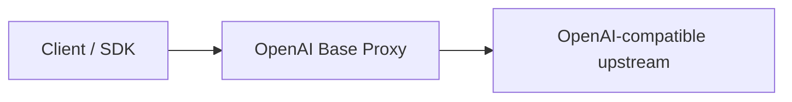

# OpenAI Base Proxy

[English](../README.md) | [简体中文](README.zh-CN.md) | [日本語](README.ja.md) | [Español](README.es.md)

OpenAI Base Proxy is a transparent Rust/Axum proxy for OpenAI-compatible APIs. It provides a nearby `base_url` while preserving upstream OpenAI API behavior.

The proxy does not validate or rewrite OpenAI-specific request fields. It forwards HTTP bodies, streaming responses, multipart uploads, binary downloads, and WebSocket frames as transparently as possible.

## Main Features

- Transparent forwarding of client-provided `Authorization: Bearer ...`.
- HTTP forwarding for `/v1/...` OpenAI-compatible endpoints.
- Streaming request and response bodies.
- SSE, file content, audio, and binary response support.
- WebSocket forwarding for Realtime, Realtime translation, sideband controls, and Responses WebSocket mode.
- HTTP forwarding for WebRTC SDP/session setup endpoints.
- Optional proxy-side protection with `x-proxy-token`.
- Built-in Scalar docs at `/docs`, `/scalar`, and `/openapi.json`.

## Architecture



HTTP requests are streamed to the configured upstream after hop-by-hop headers, `Host`, `Content-Length`, and proxy-only headers are removed. WebSocket connections are established upstream first, then bridged frame by frame.

## Supported API Areas

| Area | Status |
| --- | --- |
| Responses API | Supported, including SSE and WebSocket mode |
| Chat Completions | Supported |
| Embeddings | Supported |
| Images | Supported |
| Audio | Supported |
| Files and Uploads | Supported |
| Batches | Supported |
| Fine-tuning | Supported |
| Moderations and Models | Supported |
| Realtime WebSocket | Supported |
| Realtime translation WebSocket | Supported |
| WebRTC setup HTTP endpoints | Supported |
| WebRTC media / SIP media / webhooks | Out of scope |

## Run Locally

```bash
cp .env.example .env
cargo run
```

```bash
curl http://127.0.0.1:3000/v1/models \
  -H "Authorization: Bearer $OPENAI_API_KEY"
```

## Docker

```bash
docker build -t openai-base-proxy .
docker run --rm -p 3000:3000 -e PROXY_TOKEN=proxy-secret openai-base-proxy
```

## Production Notes

- Enable `PROXY_TOKEN` for public deployments.
- Put the service behind TLS.
- Redact `Authorization`, `x-proxy-token`, and `Sec-WebSocket-Protocol` in logs.
- Do not log request or response bodies.
- Add infrastructure-level rate limits and connection limits.

## Verification

```bash
cargo fmt --check
cargo test
cargo clippy --all-targets --all-features -- -D warnings
cargo build --release
```
