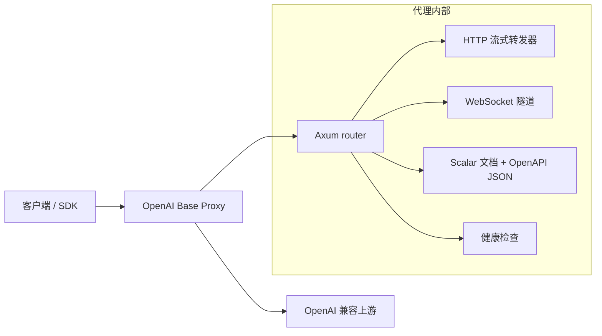

# OpenAI Base Proxy

[English](../README.md) | [简体中文](README.zh-CN.md) | [日本語](README.ja.md) | [Español](README.es.md)

OpenAI Base Proxy 是一个小型 Rust/Axum 透明代理，面向 OpenAI 兼容 API。它适合部署在客户端附近，提供稳定的 OpenAI 兼容 `base_url`，同时保留 OpenAI API 语义：代理不会校验、改写或收窄请求字段。

默认上游是 `https://api.openai.com`。

## 为什么需要它

某些地区、网络或生产环境直接访问 OpenAI API 时延较高，或连接不够稳定。这个代理可以部署在更靠近用户或基础设施的位置，同时让客户端行为尽量接近直接调用 OpenAI。

核心设计规则很简单：

> 如果客户端发送的是 OpenAI API 请求，代理会把它转发给上游 API，而不会理解或限制 OpenAI 业务字段。

这意味着未来新增的 OpenAI 请求参数、模型专属选项、multipart 上传、SSE 流、WebSocket 事件和二进制响应，都可以保持透传兼容。

## 功能特性

- 透明 BYOK 转发：客户端的 `Authorization: Bearer ...` 会传给上游 API。
- 对 OpenAI 兼容的 `/v1/...` 端点做透明 HTTP 转发。
- 请求体流式转发：上传内容不会先被完整缓存。
- 响应体流式转发：SSE、二进制下载、音频和文件内容会流式返回客户端。
- 支持 OpenAI `/v1/...` WebSocket 代理，包括 Realtime、Realtime translation、sideband/server controls 和 Responses WebSocket mode。
- 通过普通 HTTP 转发支持 WebRTC 建连端点，包括 SDP body。
- 保留上游状态码、响应体，以及 `x-request-id`、rate-limit headers、`retry-after`、`location`、`content-range`、`content-encoding` 等端到端 header。
- 过滤 hop-by-hop headers、`Host`、`Content-Length` 和仅代理使用的认证 header。
- 可选通过 `x-proxy-token` 增加代理侧 token。
- 内置 Scalar API reference UI，路径为 `/docs`。
- 健康检查路径为 `/__healthz`。

## 非目标

本项目有意不做以下事情：

- 解析或校验 OpenAI JSON 请求字段；
- 改写模型名称；
- 注入服务端自有 OpenAI key；
- 缓存响应；
- 默认实现限流；
- 终止或中继 WebRTC 媒体流量；
- 实现 SIP/TLS 电话媒体处理；
- 接收或验证 OpenAI webhooks；
- 重新实现 OpenAI SDK 行为。

这些选择让代理保持轻量和兼容。

## 架构



### HTTP 数据流

1. 客户端使用 OpenAI 兼容路径调用代理，例如 `/v1/responses`。
2. 代理使用 `UPSTREAM_BASE_URL + path_and_query` 构造上游 URL。
3. 移除 hop-by-hop headers、`Host`、`Content-Length` 和 `x-proxy-token`。
4. 使用 `reqwest::Body::wrap_stream` 将请求体流式发送给上游。
5. 将上游响应状态码、headers 和 body stream 返回给客户端。

代理不会反序列化 OpenAI 请求体。JSON、multipart form data、SDP、文本、二进制 payload 和未来新的请求形态都走同一条转发路径。

### WebSocket 数据流

1. 客户端在 `/v1/...` 下发送 WebSocket `Upgrade` 请求。
2. 代理将 `https://` 上游映射为 `wss://`，将 loopback `http://` 上游映射为 `ws://`。
3. 在接受客户端 upgrade 之前，先建立上游 WebSocket 连接。
4. 保留 `Authorization`、`OpenAI-Safety-Identifier` 和 `Sec-WebSocket-Protocol` 等端到端 headers。
5. 将上游选中的 subprotocol 返回给客户端。
6. 双向转发 text、binary、ping、pong 和 close frames。

只要路径位于 `/v1/...` 下，不支持的 WebSocket 路径会交给上游 API 自行接受或拒绝。

## 支持的 OpenAI API 范围

因为 HTTP 转发对路径和请求体都是透明的，代理的目标是支持当前和未来所有位于 `/v1/...` 下的 OpenAI 兼容 REST 端点。

| 领域 | 状态 | 说明 |
| --- | --- | --- |
| Responses API | 支持 | HTTP 和 SSE streaming 会被转发。`/v1/responses` 支持 Responses WebSocket mode。 |
| Chat Completions | 支持 | HTTP 和 streaming responses 都会透明转发。 |
| Embeddings | 支持 | 转发 JSON 请求和响应。 |
| Images | 支持 | JSON、multipart、streaming events 和类二进制 payload 由通用 HTTP 路径转发。 |
| Audio | 支持 | Speech、transcription、translation、multipart uploads、SSE 和二进制音频响应由流式 HTTP 转发处理。 |
| Files | 支持 | 上传和文件内容下载会被转发，包括二进制和 range-style 响应。 |
| Uploads | 支持 | multipart upload parts 会被转发，不改写 boundaries 或重复字段。 |
| Batches | 支持 | Batch 创建和输出文件下载会被转发。 |
| Fine-tuning | 支持 | HTTP 端点会被转发。 |
| Moderations | 支持 | HTTP 端点会被转发。 |
| Models | 支持 | list/retrieve/delete 请求会被转发。 |
| Realtime WebSocket | 支持 | `/v1/realtime?model=...` 和 `/v1/realtime?call_id=...`。 |
| Realtime translation WebSocket | 支持 | `/v1/realtime/translations?model=...`。 |
| Realtime WebRTC setup | 支持 | HTTP SDP/session 创建端点会被转发。WebRTC 媒体本身不由本代理转发。 |
| Realtime SIP control plane | 通过 HTTP/WS 转发支持 | 不代理 SIP media 和 SIP/TLS trunking。 |
| Webhooks | 不属于代理职责 | OpenAI 会调用你的应用。本服务不接收或验证 webhooks。 |

## API 文档

代理提供本地文档：

- `GET /docs` - Scalar API reference UI。
- `GET /scalar` - `/docs` 的别名。
- `GET /openapi.json` - Scalar 使用的 OpenAPI 3.1 文档。

OpenAPI 文档描述的是代理自身的接口面和已记录的传输行为。它有意不枚举 OpenAI 请求 schema，因为这样做会降低代理对未来接口的兼容性。

## 配置

| 环境变量 | 默认值 | 说明 |
| --- | --- | --- |
| `BIND_ADDR` | `0.0.0.0:3000` | 代理监听地址。 |
| `UPSTREAM_BASE_URL` | `https://api.openai.com` | OpenAI 兼容上游 base URL。 |
| `OPENAI_BASE_URL` | 未设置 | 当 `UPSTREAM_BASE_URL` 未设置时使用的别名。 |
| `PROXY_TOKEN` | 未设置 | 可选代理侧 token，要求客户端发送 `x-proxy-token`。 |
| `OPENAI_PROXY_TOKEN` | 未设置 | 当 `PROXY_TOKEN` 未设置时使用的别名。 |
| `CONNECT_TIMEOUT_SECS` | `30` | 上游 TCP 连接超时。长流式请求不受总请求超时限制。 |

`UPSTREAM_BASE_URL` 必须使用 HTTPS，但测试和本地开发允许使用 loopback HTTP。

## 本地运行

```bash
cp .env.example .env
cargo run
```

尝试健康检查：

```bash
curl http://127.0.0.1:3000/__healthz
```

通过代理调用 OpenAI API：

```bash
curl http://127.0.0.1:3000/v1/models \
  -H "Authorization: Bearer $OPENAI_API_KEY"
```

启用代理侧保护：

```bash
PROXY_TOKEN=proxy-secret cargo run

curl http://127.0.0.1:3000/v1/models \
  -H "x-proxy-token: proxy-secret" \
  -H "Authorization: Bearer $OPENAI_API_KEY"
```

## OpenAI SDK 用法

将 SDK 的 `base_url` 或等价选项指向这个代理。

示例：

```text
http://127.0.0.1:3000/v1
```

客户端仍然应该发送自己的 OpenAI API key：

```text
Authorization: Bearer <your OpenAI API key>
```

如果配置了 `PROXY_TOKEN`，客户端还需要发送：

```text
x-proxy-token: <proxy token>
```

## WebSocket 示例

Realtime：

```bash
websocat \
  -H "Authorization: Bearer $OPENAI_API_KEY" \
  "ws://127.0.0.1:3000/v1/realtime?model=gpt-realtime-2.1"
```

Realtime translation：

```bash
websocat \
  -H "Authorization: Bearer $OPENAI_API_KEY" \
  "ws://127.0.0.1:3000/v1/realtime/translations?model=gpt-realtime-translate"
```

Responses WebSocket mode：

```bash
websocat \
  -H "Authorization: Bearer $OPENAI_API_KEY" \
  "ws://127.0.0.1:3000/v1/responses"
```

## Docker 部署

构建：

```bash
docker build -t openai-base-proxy .
```

运行：

```bash
docker run --rm -p 3000:3000 \
  -e BIND_ADDR=0.0.0.0:3000 \
  -e PROXY_TOKEN=proxy-secret \
  openai-base-proxy
```

## Systemd 部署

示例 unit：

```ini
[Unit]
Description=OpenAI Base Proxy
After=network-online.target
Wants=network-online.target

[Service]
Type=simple
WorkingDirectory=/opt/openai-base-proxy
Environment=BIND_ADDR=127.0.0.1:3000
Environment=UPSTREAM_BASE_URL=https://api.openai.com
Environment=PROXY_TOKEN=change-me
ExecStart=/opt/openai-base-proxy/openai-base-proxy
Restart=always
RestartSec=3

[Install]
WantedBy=multi-user.target
```

公网部署时，请将服务放在 Nginx、Caddy、Envoy 或云负载均衡等 TLS 反向代理之后。

## 生产环境注意事项

- 当代理暴露到 localhost 或可信私有网络之外时，请设置 `PROXY_TOKEN`。
- 在反向代理或负载均衡处终止 TLS。
- 日志中应脱敏 `Authorization`、`x-proxy-token` 和 `Sec-WebSocket-Protocol`。浏览器 Realtime WebSocket 示例可能会把 API key 放在 subprotocol 值里。
- 公网部署时在基础设施层增加限流和连接数限制。
- 将代理部署在靠近客户端或服务器的位置，以降低时延。
- 避免记录请求体和响应体。OpenAI API body 可能包含用户数据、文件、音频或密钥。

## 验证

运行：

```bash
cargo fmt --check
cargo test
cargo clippy --all-targets --all-features -- -D warnings
cargo build --release
```

集成测试覆盖：

- HTTP method/path/query/header/body 转发。
- SSE 响应流式转发。
- multipart 上传 boundary 和重复字段保留。
- 请求体流式上传，不完整缓存。
- 二进制和 range-style 文件下载行为。
- 代理侧 token 校验。
- Realtime WebSocket 转发。
- Realtime translation WebSocket 转发。
- Responses WebSocket mode。
- 浏览器风格的 WebSocket subprotocol 转发。
- 上游 WebSocket handshake error 透明返回。
- WebRTC SDP HTTP 转发。
- Scalar docs 和 OpenAPI JSON 端点。

## 设计取舍

### 为什么不校验 OpenAI 请求 schema？

校验会降低代理对新 OpenAI 字段和模型专属参数的兼容性。上游 API 应该继续作为事实来源。

### 为什么移除 `Content-Length`？

代理会流式传输请求体和响应体。移除 `Content-Length` 后，HTTP stack 可以在 hop-by-hop 过滤之后选择安全的传输 framing。

### 为什么不代理 WebRTC 媒体？

WebRTC 媒体不是普通 HTTP 或 WebSocket 流量。中继媒体需要处理 TURN/SFU/ICE/DTLS/SRTP，或者让代理充当 WebRTC peer，这超出了本代理的范围。

### 为什么提供简化的 OpenAPI 文档？

OpenAPI 文档描述的是代理，而不是完整 OpenAI API schema。目标是说明运维和传输行为，而不是冻结上游请求字段。
