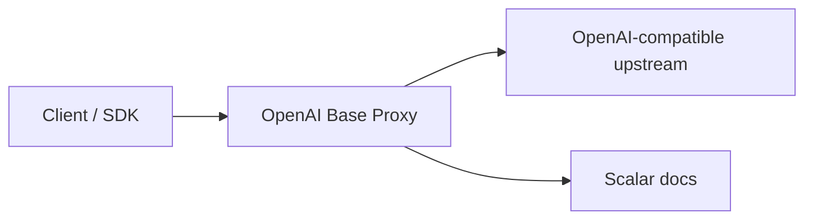

# OpenAI Base Proxy

[English](../README.md) | [简体中文](README.zh-CN.md) | [日本語](README.ja.md) | [Español](README.es.md)

OpenAI Base Proxy 是一个使用 Rust 和 Axum 编写的 OpenAI-compatible 透明代理。它的目标是给客户端提供一个稳定、就近的 `base_url`，同时尽量保持和直接调用 OpenAI API 一致的语义。

核心原则：

> 客户端传什么 OpenAI 请求，代理就尽量原样转发什么请求，不在本地限制 OpenAI 业务字段。

## 能力概览

- 透明转发客户端自己的 `Authorization: Bearer ...`。
- 支持 `/v1/...` HTTP 接口透明转发。
- 请求体和响应体都走流式转发，不先完整缓存。
- 支持 SSE、二进制下载、音频、文件内容。
- 支持 OpenAI `/v1/...` WebSocket Upgrade，包括 Realtime、Realtime translation、Responses WebSocket mode。
- 支持 WebRTC SDP/session 创建等 HTTP 控制面接口；不代理 WebRTC 媒体本身。
- 保留上游状态码、响应 body 和端到端 header，如 `x-request-id`、rate-limit header、`retry-after`、`location`、`content-range`。
- 可选 `x-proxy-token` 作为代理侧保护。
- 内置 Scalar 文档：`/docs`、`/scalar`、`/openapi.json`。

## 架构



HTTP 请求路径：

1. 客户端请求代理，例如 `/v1/responses`。
2. 代理拼接 `UPSTREAM_BASE_URL + path_and_query`。
3. 移除 hop-by-hop header、`Host`、`Content-Length` 和 `x-proxy-token`。
4. 请求体以 stream 方式发给上游。
5. 上游响应状态码、header、body stream 返回给客户端。

WebSocket 请求路径：

1. 客户端发起 `/v1/...` WebSocket Upgrade。
2. 代理先连接上游 WebSocket。
3. 连接成功后接受客户端 upgrade。
4. 双向转发 text、binary、ping、pong、close frame。

## 支持的 OpenAI 接口情况

| 接口类别 | 状态 |
| --- | --- |
| Responses API | 支持 HTTP、SSE、Responses WebSocket mode |
| Chat Completions | 支持 |
| Embeddings | 支持 |
| Images | 支持 JSON、multipart、streaming 事件 |
| Audio | 支持 multipart、SSE、二进制音频响应 |
| Files | 支持上传和文件内容下载 |
| Uploads | 支持 multipart upload parts |
| Batches | 支持 |
| Fine-tuning | 支持 HTTP 接口 |
| Moderations | 支持 |
| Models | 支持 |
| Realtime WebSocket | 支持 `/v1/realtime` |
| Realtime translation WebSocket | 支持 `/v1/realtime/translations` |
| Realtime WebRTC setup | 支持 HTTP SDP/session 创建 |
| SIP 控制面 | 通过 HTTP/WS 透明转发支持 |
| Webhooks | 不属于此代理职责 |

## 本地运行

```bash
cp .env.example .env
cargo run
```

健康检查：

```bash
curl http://127.0.0.1:3000/__healthz
```

通过代理调用 OpenAI：

```bash
curl http://127.0.0.1:3000/v1/models \
  -H "Authorization: Bearer $OPENAI_API_KEY"
```

启用代理侧 token：

```bash
PROXY_TOKEN=proxy-secret cargo run

curl http://127.0.0.1:3000/v1/models \
  -H "x-proxy-token: proxy-secret" \
  -H "Authorization: Bearer $OPENAI_API_KEY"
```

## 部署建议

- 公网部署一定要启用 `PROXY_TOKEN`。
- 使用 Nginx、Caddy、Envoy 或云负载均衡做 TLS 终止。
- 日志中必须脱敏 `Authorization`、`x-proxy-token`、`Sec-WebSocket-Protocol`。
- 不要记录请求体和响应体。
- 在基础设施层增加限流、连接数限制和访问控制。

## Docker

```bash
docker build -t openai-base-proxy .

docker run --rm -p 3000:3000 \
  -e BIND_ADDR=0.0.0.0:3000 \
  -e PROXY_TOKEN=proxy-secret \
  openai-base-proxy
```

## 验证

```bash
cargo fmt --check
cargo test
cargo clippy --all-targets --all-features -- -D warnings
cargo build --release
```

测试覆盖了 HTTP 透明转发、SSE、multipart、请求体流式上传、二进制/Range 下载、WebSocket、Realtime translation、Responses WebSocket、WebRTC SDP 和 Scalar 文档。
